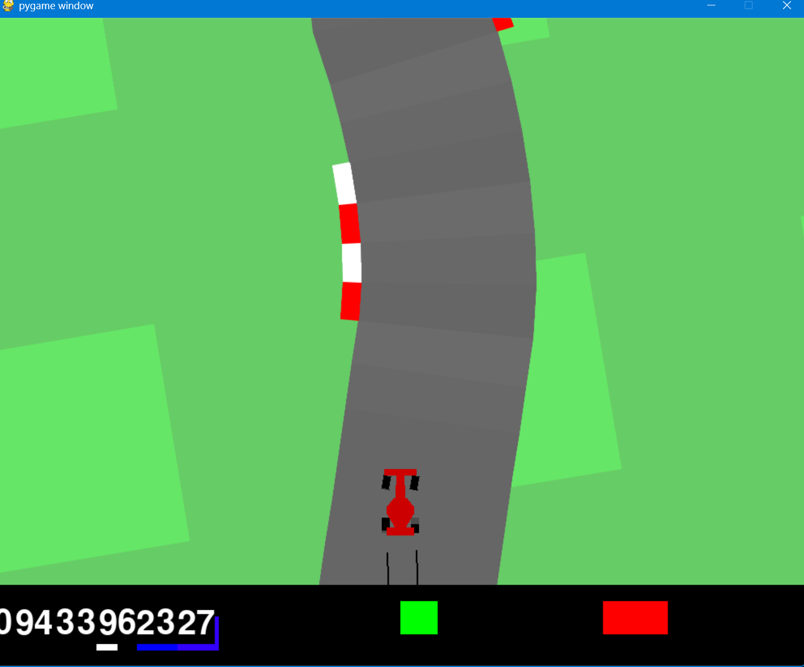

```markdown
# Ensemble Reinforcement Learning for CarRacing-v3


An implementation and empirical analysis of Ensemble Reinforcement Learning (ERL) applied to the **CarRacing-v3** environment from Gymnasium. Multiple Deep Proximal Policy Optimization (PPO) agents were trained under diverse hyperparameter configurations, and their action predictions were combined via a **majority voting mechanism** to improve decision-making stability and control robustness.

---

## 🏎️ Environment Demo & Gameplay

The agent learns continuous driving actions (steering, gas, brake) directly from pixel input to navigate the track efficiently:



*Figure 1: `CarRacing-v3` gameplay window demonstrating the trained agent maintaining optimal track positioning and trajectory.*

---

## 📌 Executive Summary & Key Findings

* **Hyperparameter Sensitivity:** Lower learning rates ($\text{LR} = 10^{-5}$) provided stable convergence, whereas higher rates ($\text{LR} = 10^{-3}$) adapted rapidly but exhibited training volatility.
* **Ensemble Superiority:** Aggregating agent actions via majority voting effectively mitigated individual agent weaknesses caused by suboptimal hyperparameter choices.
* **Continuous Monitoring:** Real-time tracking via TensorBoard confirmed overall improvement in loss reduction and reward accumulation across training runs.

---

## 📂 Project Directory Structure

```text
.
├── Training models.py         # Script to train PPO agents with customized hyperparameters
├── visualization.py           # Script to load saved models and render CarRacing-v3 gameplay
├── tensorboard.py             # Script to launch and manage TensorBoard logging
├── Car.png                    # Gameplay window screenshot
└── README.md                  # Project documentation


🛠️ Procedure & Methodology1. Environment & FrameworkEnvironment: CarRacing-v3 (Gymnasium)  Framework: Stable-Baselines3 (PPO Algorithm)  Monitoring: TensorBoard logging for rewards, losses, and evaluation metrics  2. Hyperparameter ConfigurationsThree distinct PPO agents were trained for 300,000 timesteps each:  Agent 1: $\text{Learning Rate} = 3 \times 10^{-4}$ (Standard parameters)[cite: 3]Agent 2: $\text{Learning Rate} = 1 \times 10^{-5}$ (Increased epochs for stability)[cite: 3]Agent 3: $\text{Learning Rate} = 1 \times 10^{-3}$ (Testing rapid adaptation)[cite: 3]3. Ensemble StrategyEach trained agent predicts an action independently based on the current environment state[cite: 3].Actions are aggregated across agents using a majority voting mechanism[cite: 3].The consensus action is executed in the environment[cite: 3].🚀 How to RunStep 1: Train the AgentsRun Training models.py to train individual PPO models. Edit the hyperparameter settings inside the script to train different agents or change architectures.Bashpython "Training models.py"
(Note: Model weights are saved locally during training and do not need to be uploaded to GitHub).Step 2: Track Metrics with TensorBoardRun tensorboard.py to view training logs, losses, and evaluation metrics in your browser.Bashpython tensorboard.py
Step 3: Evaluate and Visualize GameplayRun visualization.py to load the saved agent weights, execute the majority-voting ensemble, and render the CarRacing-v3 interactive Pygame window (as shown in Car.png).Bashpython visualization.py
